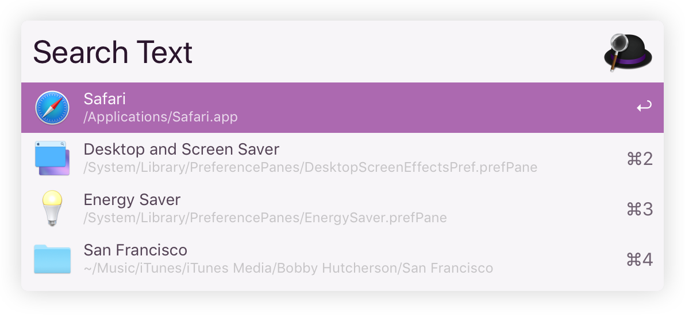
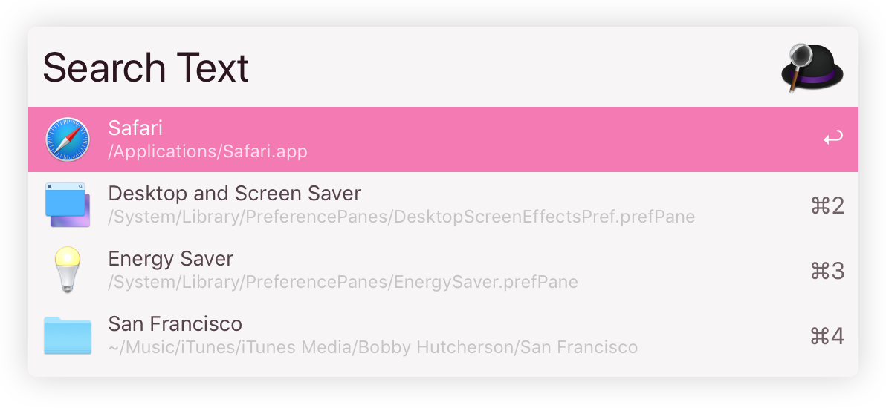
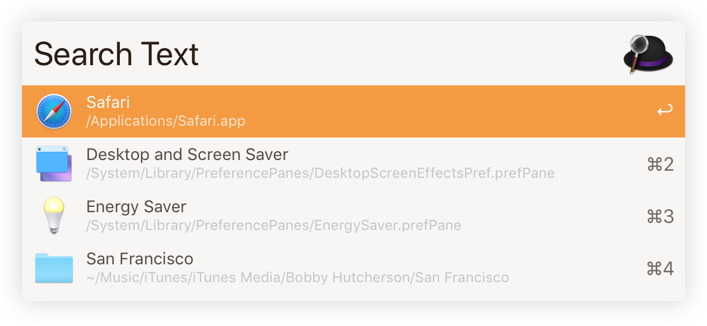
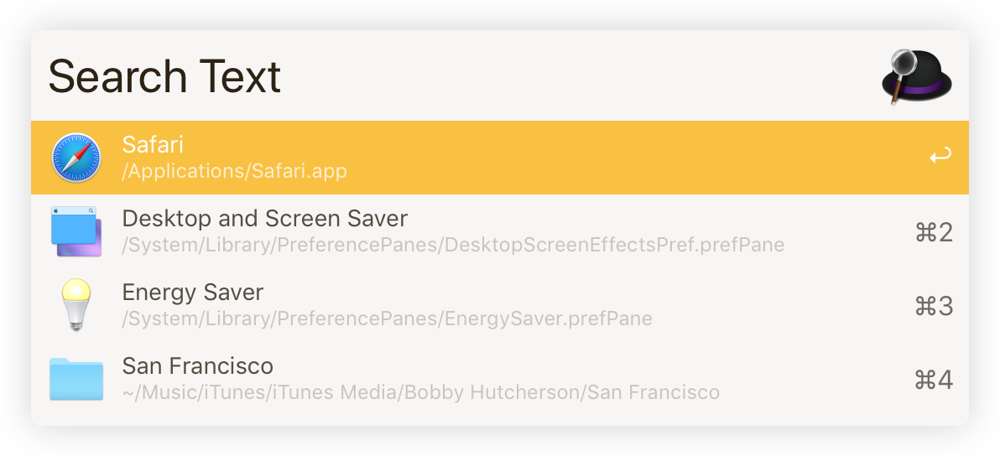
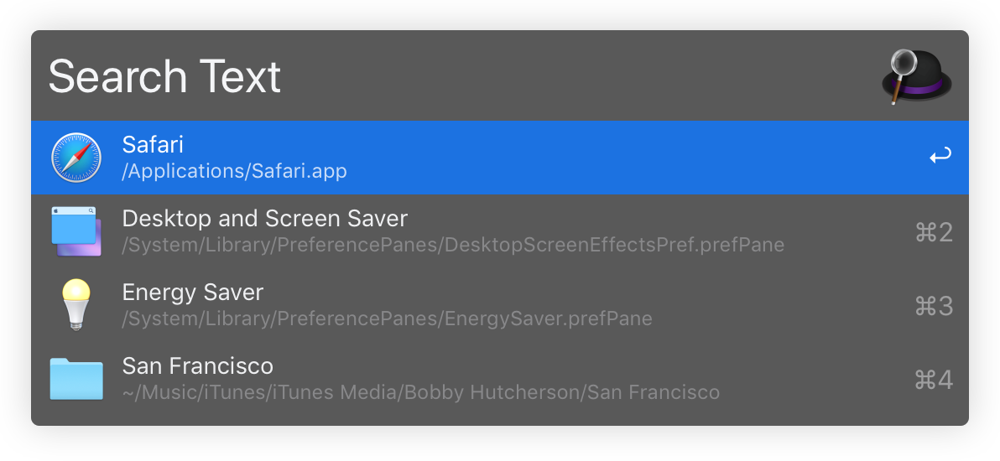
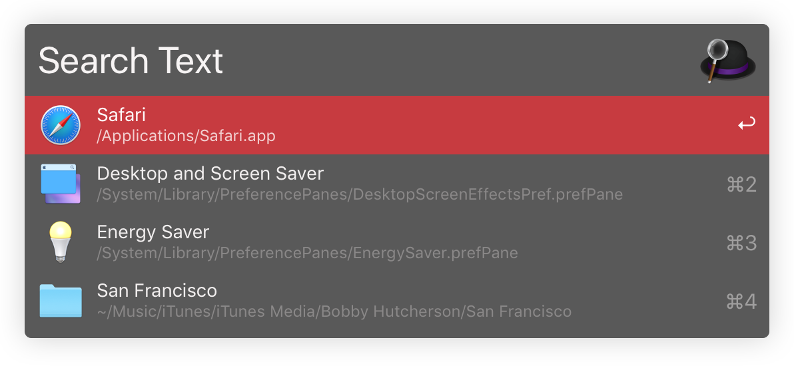
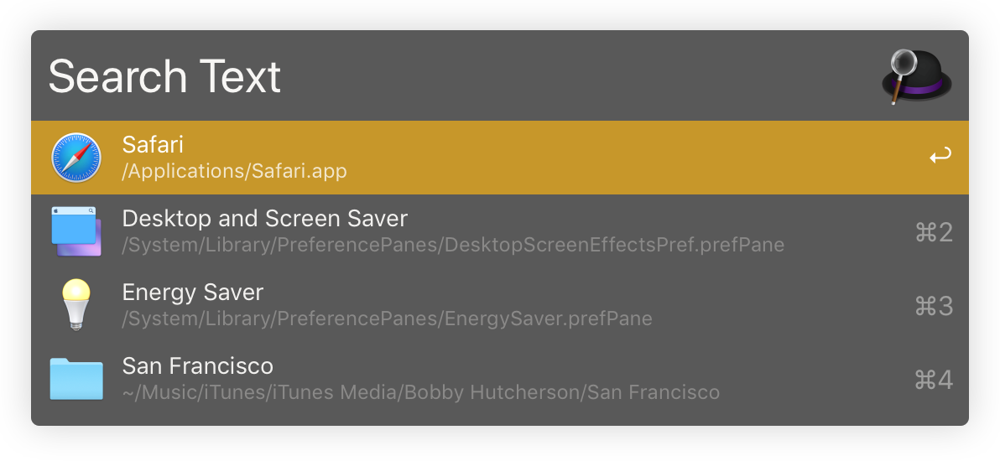

# Mojave Alfred Accented Themes
Collection of Dark & Light Accented Alfred Themes tailored with care for macOS Mojave & Alfred Powerpack users.  
You can have any color! Well, as long as it's *not* Black 🎩

## Installation

You can either download the whole repository, and double-click each theme to install it in Alfred,
or click the links under the screenshots to install the themes you want via Alfred's website.

I personnaly rock the Light Purple one most of the time, and disabled the Hat Logo in Alfred's Preferences.

## Previews

  

  

  

  

  

  

  

  

  

  

  

  

  

  

  

  

  

  

  

  

  

  

  

  

  

  

  

  

  

  

  

  

## Inspiration

Thanks to <a href="https://github.com/dvlden/alfred-themes">dvldev for his stylish themes</a>,
which inspired me to further embrace macOS Mojave's Accent Colors 🙏
